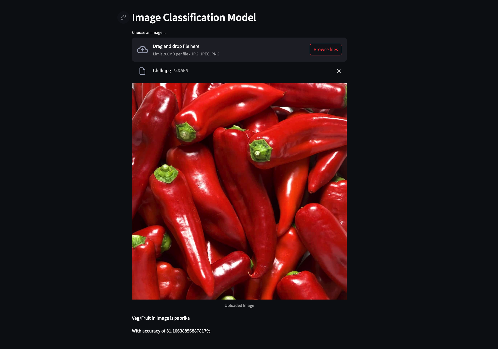
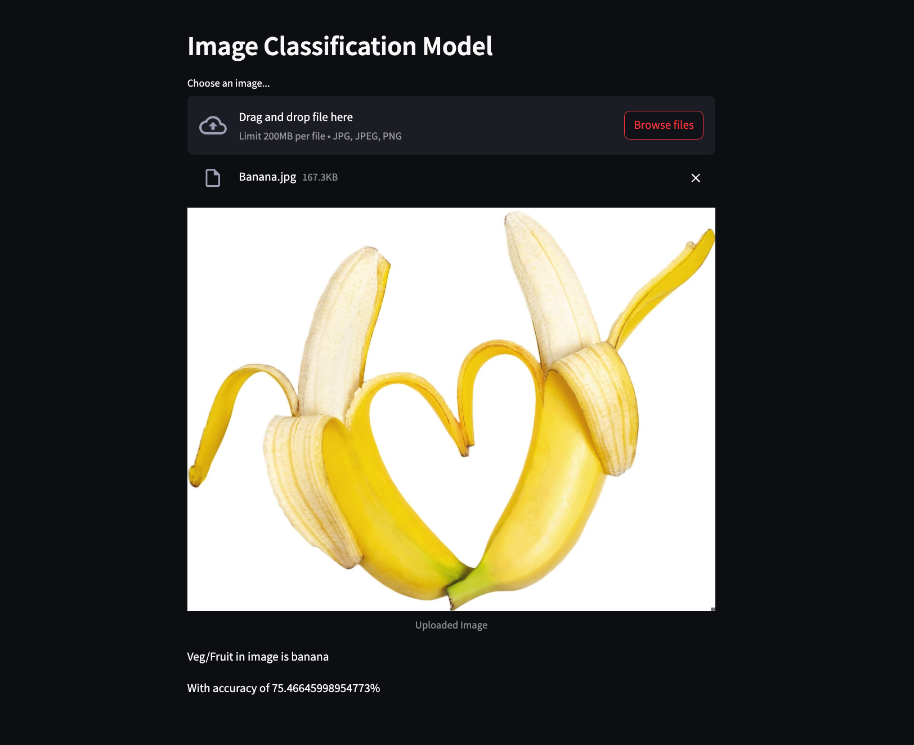

# Fruit and Vegetable Classifier

## Overview
This project is a fruit and vegetable classifier that uses deep learning techniques to classify images of fruits and vegetables. 

## Features
- Image classification: The system can classify various fruits and vegetables based on input images.
- Deep learning model: The classifier uses a  convolutional neural network (CNN) for accurate predictions.
- Streamlit frontend: The user interface is built using Streamlit, providing an interactive platform for image classification.

## Technologies Used
- Python
- TensorFlow
- Keras
- NumPy
- Streamlit
- Kaggle CLI (for dataset retrieval)

## Screenshots
Here are some screenshots of the Fruit and Vegetable Classifier:

## Getting Started
To get started with the Fruit and Vegetable Classifier, follow these steps:

1. Install the required Python libraries using `pip install -r requirements.txt`.
2. Fetch the dataset from Kaggle using `kaggle datasets download nimapourmoradi/fruits-and-vegetables-image-mobilenetv2`.
3. Extract the downloaded zip file into a folder named `dataset`.
4. Train the deep learning model using the Jupyter notebook `Image_Class_Model.ipynb`.
5. Run the Streamlit app for classification using `streamlit run app.py`.

## Folder Structure
- `dataset/`: Contains the downloaded dataset.
- `Image_Class_Model.ipynb`: Jupyter notebook for model training.
- `app.py`: Streamlit app for classification.

## Acknowledgments
- Dataset: [Fruits and Vegetables Image - MobileNetV2](https://www.kaggle.com/nimapourmoradi/fruits-and-vegetables-image-mobilenetv2) by Nima Pourmoradi

---

Feel free to customize this README further to include additional details or instructions specific to your project. Include the actual screenshots in the `screenshots/` directory and update the image paths accordingly in the README file.
